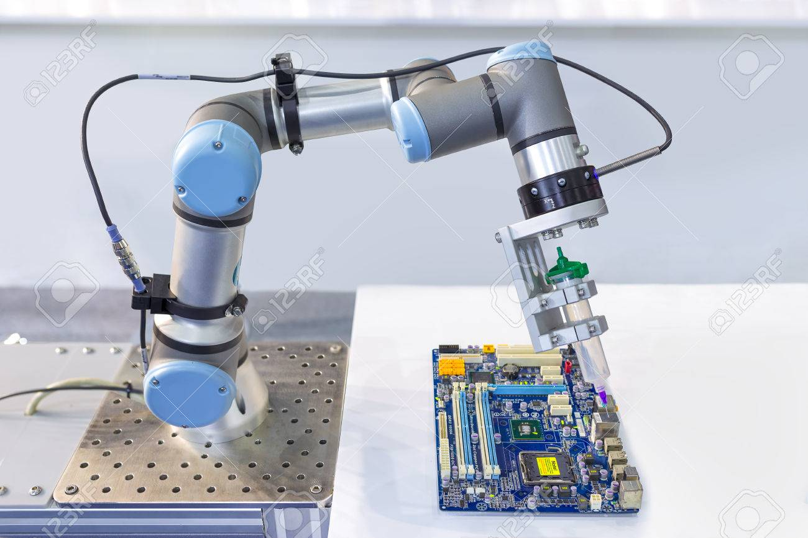
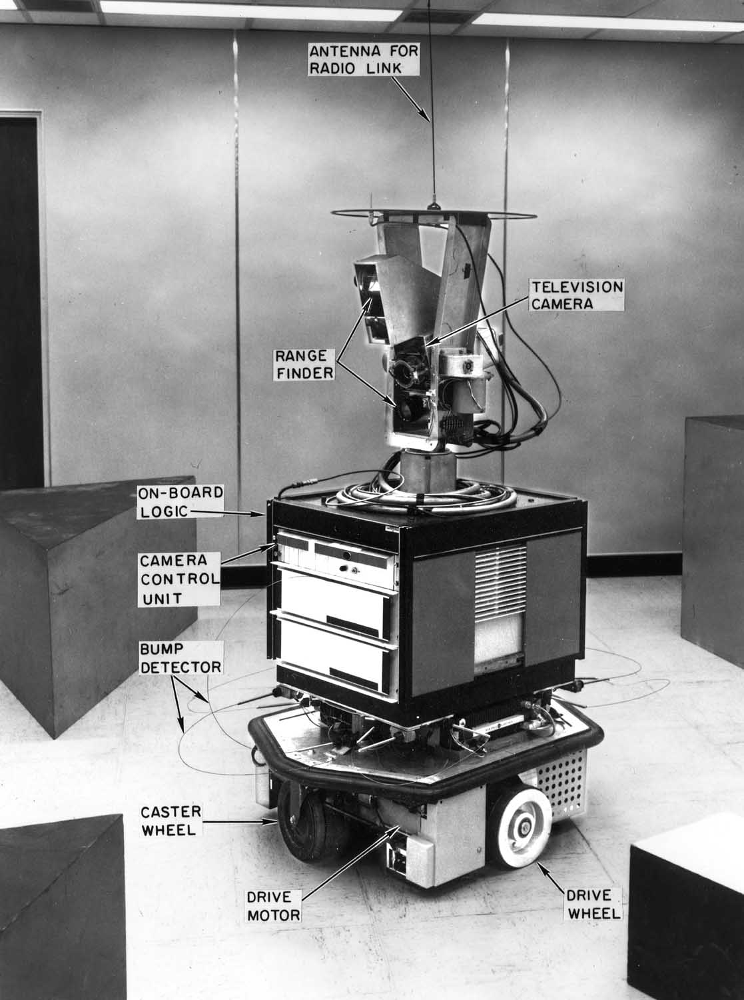
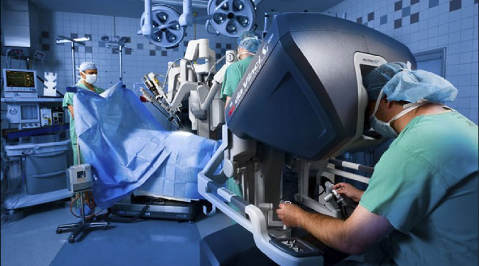

[comment]: # (
Is this step open? Y/N
If so, short description of this step:
Related links:
Related files:
)

## The world of robotics

Robots are now an integral part of modern life and are set to be even more prominent in the future. Before building a robot buggy of your own, it is useful to understand the different components and technologies that can be used with robotics, and how these can work together to automate actions.

### What makes a robot a robot?

Robots in todays age come in all shapes and sizes and are able to perform a wide range of tasks, from building cars to landing on Mars. But defining what a robot actually **is** can be tricky; ask five roboticists and you are likely to get five different answers! 

Nevertheless, there are some common features that most robots share:

+ A physical body that can move
+ Mechanisms for moving the structure
+ A source of power
+ Sensors for receiving data about the world around them
+ The ability to process information and automate tasks 

The capabilities of a robot can vary massively. For example, a robot that is designed to manufacture microchips will need to make tiny, precise movements in a fixed place whilst a humanoid robot may be able to walk around its environment. What nearly all robots can do though is these three things: sense, process, and act.

### Making sense of the environment

Just like people and animals, robots are able to sense the physical world so they can perform actions accordingly. Robots often use sensors to detect the movement of their own components as well as other objects nearby. A robotic arm in a factory for assembling smartphones will use a motion sensor to calculate the distance it has moved and where it needs to go next. It may also use a pressure sensor to determine how much force it is holding a component by so it does not drop or break it.

The first truly mobile robot with the ability to sense its environment was "Shakey" which was developed at Stanford University between 1966 and 1972. It was capable of navigating various obstacles inside a room using a TV camera and an infrared range finder to scan items in front of it. Shakey also had whisker-like feelers to determine if it was touching another object. Instead of relying on a pre-programmed set of instructions, Shakey could piece together simple commands to perform more complex tasks, as well as remember and adjust these actions for future tasks. This led to advances in artificial intelligence and pathfinding.

Improvements to sensors over the years allowed robots to receive more data to better understand the environment. A major contribution to the ability for robots to navigate the world is LiDAR, which uses the pulse of light from lasers to measure distances accurately. For example, self-driving cars use LiDAR to create 3D maps and build a picture of the world. Yet with all this extra information, robots also needed to become more powerful at processing data in a quick and timely manner. 

### The power of processing

Nearly all robots need a device, such as a computer or microcontroller, to receive data from sensors and other components. The device will need to process this data into meaningful information that can then be used to communicate instructions.

One such device is a Raspberry Pi, which is a single board computer that allows a wide range of components to be connected to it. In this course, you will be using a Raspberry Pi to connect the different parts of the robot buggy together. You will also program the Raspberry Pi to handle all of the decision making of the buggy and automate tasks. 

### Automation in action

The ability to process data and act on this information almost instantly with minimal human interaction is one of the major advancements of robotics, and indeed technology, in the last few decades. Most robots will be able to perform some actions autonomously, whether it is a robotic arm that twists the lids onto jars of jam in an assembly line or a drone that is able to return home to the location it took off from.  

The level of autonomy a robot is capable of depends on how it is designed to interact with the world. Some are closely controlled by human operators, such as medical robots that assist surgeons with performing operations. These types of robots enhance a surgeon's ability to make very precise incisions that would be difficult without this assistance. It can also allow surgeons to operate remotely from another hospital, or even another country entirely!

On the opposite end of the scale, other robots are much more autonomous and rely on minimal human interaction. Consider a robot vacuum cleaner: it will use sensors to move around the room whilst avoiding furniture and map the areas it has visited to ensure it has covered the entire room. Some even have the ability to automatically find a charging station and empty themselves in a designated bin. 

Many robots are somewhere in the middle between fully autonomous and human controlled, requiring a small amount of human interaction with the ability to automate tasks. These semi-autonomous robots are optimal for activities such as navigating contaminated places that would be dangerous for people. It is possible for operators to take over the decision making from the robot and perform certain actions remotely.

### Discussion

+ What are some of the robots that you interact with, either directly or indirectly?

+ Which area do you think robotics will have the biggest impact in the future? Why is that?

Share your thoughts in the comments section below.