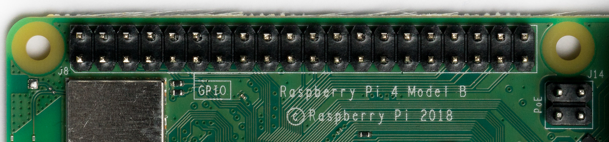
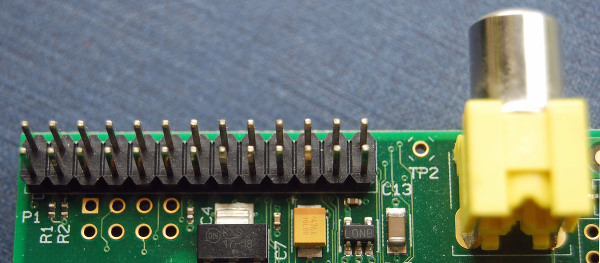
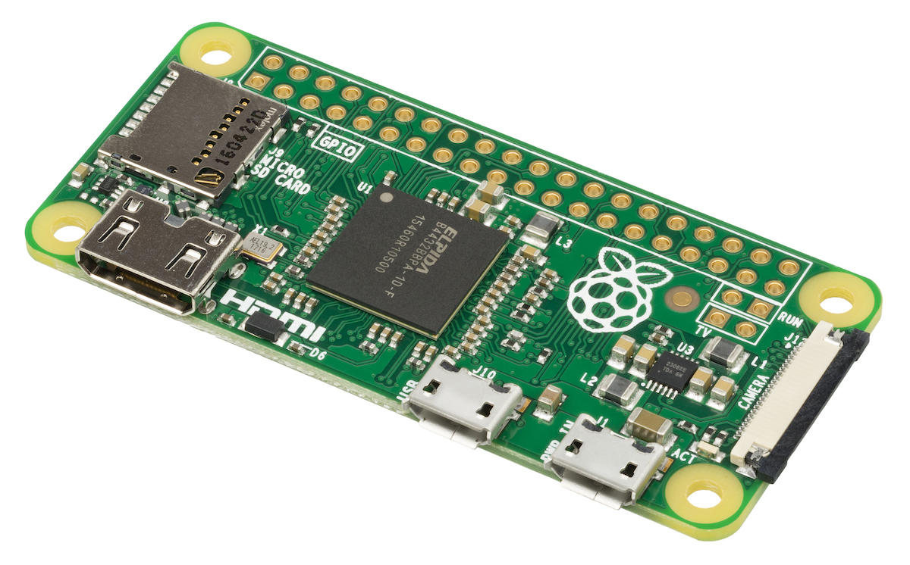

[comment]: # (
Is this step open? Y/N
If so, short description of this step:
Related links:
Related files:
)

## Raspberry Pi and general-purpose input/output

Robots are able to sense and interact with the environment through a wide range of components.

So that a robot can make decisions and perform actions, it uses a processor to receive information from and send signals back to the other components.

A standard interface for connecting a single-board computer or microprocessor to other components is through general-purpose input/output (GPIO) pins.

### Controlling robots using the Raspberry Pi

The Raspberry Pi computers are wonderfully diverse in what they can do. Among the many applications they can be used for, robotics is one of the most exciting and powerful uses of a Raspberry Pi.

Each model of the Raspberry Pi has a set of general-purpose input/output (GPIO) pins along the top edge  of the board. These can be used for connecting and communicating with all manner of electronic components, acting as a physical interface between the Raspberry Pi and the outside world. Using the pins, you can program the Raspberry Pi to switch components on and off (output), or receive data from sensors and switches (input).

#### Raspberry Pi models

Most models of the Raspberry Pi have a 40 pin header as shown in the image above. Of the 40 pins, 26 are GPIO pins and the others are power or ground pins (plus two ID EEPROM pins which you should not play with unless you know your stuff!). Any of the GPIO pins can be designated (in software) as an input or output pin and used for a wide range of purposes - whether it is turning on an LED, driving a motor or sending data to another device, the possibilities are almost endless!

Early models of the Raspberry Pi A and B compromise of a shorter header of 26 pins, as shown below.

The Raspberry Pi Zero models have unpopulated pins (apart from the Raspberry Pi Zero WH) so there are holes where the GPIO header is located instead of physical pins. This means you need to add a header that includes the pins yourself.  

Although it is possible to create a robot buggy with most models of Raspberry Pi, I recommend using a Raspberry Pi 3B, 3B+ or 4. These models allow you to easily connect and program the Raspberry Pi with another computer or even a smartphone through the inbuilt Wi-Fi or Bluetooth, rather than needing to physically plug the Pi into a screen or keyboard and mouse.

#### GPIO pin numbering

When programming the GPIO pins there are two different ways to refer to them: **GPIO numbering** and **physical numbering**. Throughout this course (and in all our resources) we will refer to the pins using the GPIO numbering scheme. These are the GPIO pins as the computer sees them.

The numbering of the GPIO pins is not in numerical order, instead relating to the numbering on the CPU of the Raspberry Pi, so there is no easy way to remember them. However, you can use a reference board that fits over the pins, a printed reference, or a [website guide to the GPIO pins](http://pinout.xyz) to help you out.

#### Voltages

The voltage of a pin is labelled on the reference guide. There are two **5V** pins and two **3V3** pins, as well as a number of ground pins (0V), which are unconfigurable. The remaining pins are all general purpose 3V3 pins, meaning outputs are set to 3.3 Volts and inputs are tolerant of 3.3 Volts.

A GPIO pin designated as an **output** pin can be set to high (3.3V) or low (0V). Components are usually attached so that setting the output to high will allow current to flow to them, whilst setting the output to low won't.

A GPIO pin that is designated as an **input** will allow a signal to be received by the Raspberry Pi. The threshold between a high and a low signal is around 1.8V; a voltage between 1.8V and 3.3V will be read by the Raspberry Pi as high, anything lower than 1.8V will be read as low. Do not allow an input voltage above 3.3V or else you will fry your Pi!

#### A word of caution

While connecting most components to the GPIO pins is perfectly safe, it's important to be careful how you wire things up otherwise you could damage the Raspberry Pi or the components.

A few pieces of general advice to follow are:

+ Do not attach 3V3 components directly to a 5V pin on the Raspberry Pi (you may damage the component or your device)
+ Certain components, such as LEDs, should have resistors to limit the current passing through them
+ Do not connect motors directly to the GPIO pins, instead use a motor controller board or an H-bridge circuit

In the next step, you will look at how to connect the motors to the motor controller board.
