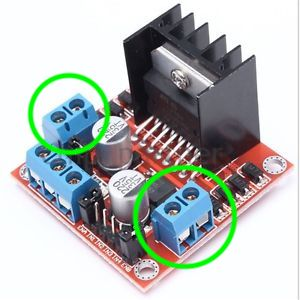

[comment]: # (
Is this step open? Y/N
If so, short description of this step:
Related links:
Related files: PDF of components
)

## Connecting a motor to the motor controller

[comment]: # (Need to create PDF of components for related file)

In this step you will start by connecting the motors to the motor controller board before connecting the battery holder to the motor controller.

The instructions are for a "L298N Dual H Bridge DC Stepper Motor Driver Controller Board", and they will be pretty similar for most motor controller boards. Check the documentation for your board if you are using a different one.

### What you will need

For this step you will need the following items:

+ Motor controller board
+ 2 x 3V - 6V DC motors
+ 4 x jumper leads (male-male or female-male) or wire
+ Screwdriver

You may also need:

+ Soldering iron and solder
+ Wire strippers
+ Scissors
+ Tape

**Using a soldering iron can be a bit daunting at first but whether you are new to soldering or a veteran solderer, this [getting started with soldering](https://projects.raspberrypi.org/en/projects/getting-started-with-soldering) resource will provide you with some quick tips and tricks.**

### The DC motors

Most DC motors do not come with wires attached to them, which means you will need to attach your own using solder.

#### Preparing the wires

You will need 2 wires for each DC motor to connect it to the motor controller board. Alternatively, you can use wire strippers to strip 2 jumper leads to expose the bare wire for attaching to each of the motors. A demonstration of how to strip a wire with wire strippers can be seen in [this video](https://www.youtube.com/watch?v=TZFTKbT4XFs).

Remove the soft plastic clip from the motors so the wires can be attached. You can use a flat head screwdriver to help remove the clip.

Thread the bare wire through the contact on the motor. **Top tip:** it may be easier to solder the wire to the contact on the motor if you bend the wire once it has passed through the contact.

#### Soldering the wires

Turn on the soldering iron and wait for it to heat up. Clean the soldering iron tip before using it; you can use a damp sponge or damp cloth to remove any residue whilst the iron is hot.

Heat the contact on the motor with the soldering iron for a second or 2. Keeping the soldering iron on the contact, touch the end of the solder to the soldering iron tip until the solder melts. Stop applying solder once the contact and wire are connected by the solder.

Wait for a minute or two for the solder to cool and then gently try to move the wire to test if it is securely attached to the contact. If the wire does move, you can either reheat the applied solder with the soldering iron and realign the wire, or apply more solder to the connection.

Try not to touch the plastic coating of the wires or any plastic between the two contacts with the soldering iron or the plastic will melt and start to smoke. More tips and guidance can be found in [this soldering tutorial](https://projects.raspberrypi.org/en/projects/getting-started-with-soldering).

Once the wires have been soldered to the motors securely, trim the end of the wires with scissors. If the wires accidentally touch the metal casing while power is running this can short the circuit and stop the motor from receiving consistent power.

Reattach the plastic clips to the motors. It's also a good idea to wrap the end of the motors where you attached the wire in tape, to protect the connection and help keep the solder in good condition.

### Connect the motors to the motor controller board

A motor controller board will usually have screw terminals for connecting a motor to it. A DC motor needs two screw terminals for it to work, and a servo motor needs four terminals. The four OUT terminals in the board I am using are circled in green below.

The reason a DC motor needs to use two wires is so it can turn forwards and backwards. Sending a high signal to one wire and a low signal to the other wire will turn the motor in one direction, whilst swapping the signals around to low and high will turn the motor in the other direction.

Using a screwdriver, loosen the screws in the terminal blocks labelled **OUT1**, **OUT2**, **OUT3**, and **OUT4**. Have a look at the documentation for your board if your labels are different.

Strip the ends of the wires (you can snip off the ends if you need to). Insert the stripped ends of one motor into the **OUT1** and **OUT2** terminals and the stripped ends of the second motor into the **OUT3** and **OUT4** terminals. Tighten the screws so the wires are secured firmly in the terminal blocks.

**Did you have any issues connecting the motors to the motor controller?**

**Do you need help with anything that isn't working properly?**

If so, let us know in the comments below.