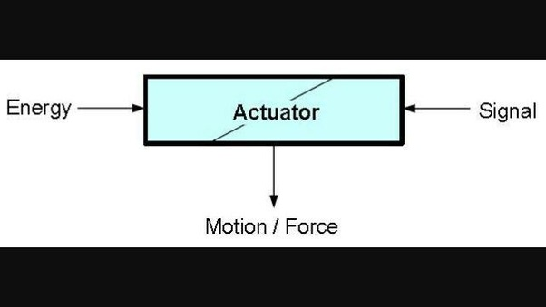

[comment]: # (
Is this step open? Y/N
If so, short description of this step:
Related links:
Related files:
)

## Mobile robots

In this step, the different ways that robots can move is discussed

### How do robots move?

Nearly all robots will have a movable body of some description. This could be a fully mobile entity that uses motorised wheels or tracks to navigate the environment. It also describes the components that are built from many moveable segments held together by adjustable joints, such as a robotic arm. 

<!-- Microcontroller / Raspberry Pi -->

The type of movements a robot can make depends on the **actuators** used. Actuators convert energy into motion, much like the muscle systems of animals. Some are great for moving things with large forces whilst others are better at controlled, precise movements. Choosing what actuators to include in your robot depends on the requirements.

Just like our muscles, actuators need a control signal to know when to act and a source of energy to exert a force. In mechanical systems, there are three types of energy sources: electrical, pneumatic, and hydraulic. 

### Electrical motors / energy

Motors use a power supply to convert electrical energy into a mechanical force.

The electric power per second (measured in watts) is the electric potential (the voltage) multiplied by the amount of moving electric charge (the current).

The more voltage / power applied to the motor, the faster it goes. If the power supplies less voltage, it will spin slower / at that speed.

**Motor controller boards**, like the one you will use when creating the robot buggy, contain an **H-bridge** as well as other useful components such as powering the batteries. An H-bridge is a simple circuit that allows you to drive motors forwards and backwards depending on the flow of current.

<!-- Power supplies -->

Three of the most common types of motors used in robotics are DC, stepper and servo motors. 

#### DC motors

A direct current motor, or DC motor, is relatively simple to control and cheap to manufacture. The speed and direction that the motor rotates depends on the voltage supplied. Providing a motor with a voltage will make it spin in one direction, whilst reversing the voltage makes it spin in the opposite direction. The higher the voltage, the faster the motor will turn and vice versa. 

<!-- Limitations of voltage allowed? -->

DC motors can rotate at very high speeds but their major downside is that they are not as good as other types of motor at performing precise movements. Nevertheless, many devices use DC motors for a whole host of applications, such as spinning computer fans and the propellers of a drone. 

#### Stepper motors

A stepper motor moves in small steps so it can perform very accurate and discrete movements. When the motor is supplied a voltage, it rotates by a fixed amount in "steps" which are much smaller increments than a DC motor. 

Stepper motors can also produce more torque (the amount of force) at low speeds which means they are excellent in devices that require precise positioning and speed control, such as 3D printers and camera lenses.

#### Servo motors

Servo: +ve angle (e.g. axel and a real car) -ve doesn’t go all the way round

Servo motors are used to control very precise angular movements. Many servo motors rotate within a 180 degree range but others are designed to continuously rotate. 

Typical / original servo motors contain stoppers to limit the rotation of the motor to 180 degrees but...

The gears inside a servo motor are designed so they produce a higher torque at higher speeds, meaning that more energy is turned into force rather than speed.

This is useful in applications where a large amount of force is required, such as the steering in a toy car

### 

Other types of actuators include pneumatic or hydraulic, which produce a force using pressure from air or liquids respectively to control the movement of components. For example, a hydraulic leg of a robot contains pressurised liquid that can be released by opening a valve which emits a force to extend the piston attached to the leg. The valve would be then be closed again and the pressure aloud to build so this process can be repeated.

### Examples ###

motors, pumps, switches and valves

### Hard and soft actuators?

Link to the replication of animals and human movements / behaviour.

### Mobile robotics

One of the first truly mobile robots was the Stanford Cart which started life in 1960 with the goal of controlling a rover on the moon from Earth. 

 one of the pioneers of autonomous vehicles and helped shape the technology behind driverless cars.

- Stanford Cart (1960), "Shakey (1966) A not-inaccurate name for a trembling machine developed between 1966 and 1972. It was the first truly perceptive and mobile robot, capable of navigating obstacles in a room."

- Asimo (2000) Honda’s first humanoid robot

"To make things more concrete, consider BigDog, a rough-terrain quadruped robot developed by U.S. firm Boston Dynamics. BigDog uses sensors to measure the position of its leg joints and the forces applied on them. It also uses gyroscopes and an inertial measurement unit (IMU) to keep track of its position in relation to the ground. Based on that information, BigDog’s computer calculates which hydraulic actuators it should activate to move the robotic legs.

As BigDog takes a step, it’s continually (several thousand times per second) updating its sensor, computer, and actuator information in a feedback loop that allows the robot to autonomously walk, trot, climb hills, and step over obstacles.

To build BigDog, Boston Dynamics engineers studied how real animals run and balance, and they used some of those ideas to design the robot’s sensing, computing, and actuation systems, combining these three components in a feedback loop."

### Other

as well as an intricate system of adjustable joints

There are three categories of actuator: electrical motors, pneumatic systems, and hydraulic systems.

### Discussion

+ Can you think of any other mobile robots? How could 