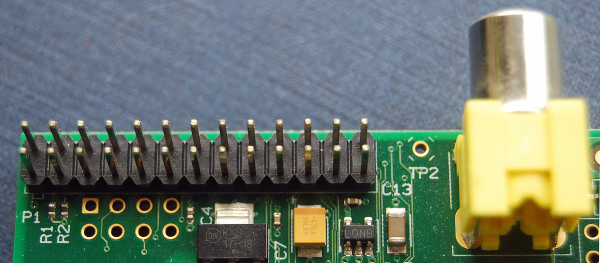

[comment]: # (
Is this step open? Y/N
If so, short description of this step:
Related links:
Related files:
)

## Raspberry Pi and general-purpose input/output

Robots can sense and interact with the environment through a wide range of components, which usually rely on a computer or microcontroller to process information and make decisions. This is where the Raspberry Pi and the general-purpose input/output (GPIO) pins come into play.

### Controlling robots using the Raspberry Pi

The Raspberry Pi computers are wonderfully diverse in what they can do. Among the many applications they can be used for, robotics is one of the most exciting and powerful uses of a Raspberry Pi.

Nearly all robots need a computer or microcontroller to communicate instructions to the physical components, receive data from components, and make decisions based on all this information. What makes devices such as the Raspberry Pi so versatile is the inclusion of general-purpose input/output (GPIO) pins.

### GPIO pins

Each model of the Raspberry Pi has a row of general-purpose input/output (GPIO) pins that are a really useful feature for connecting and communicating with all manner of electronic components. Whether it is turning on an LED, driving a motor or sending data to another device - the possibilities are almost endless! 

The GPIO pins are located along the top edge of the board. Most models of the Raspberry Pi have a 40 pin header that looks like this:

[comment]: # (Source Raspberry Pi 4 image)

The Raspberry Pi Zero models have unpopulated pins, so there are holes where the GPIO header is located instead of physical pins. This means you need to add a header that includes the pins yourself.  

[comment]: # (picture?)

Early models of the Raspberry Pi A and B compromise of a shorter header of 26 pins and look like this:

These pins are a physical interface between the Raspberry Pi and the outside world. Using them, you can program the Raspberry Pi to switch components on and off (output), or receive data from sensors and switches (input). 

Of the 40 pins, 26 are GPIO pins and the others are power or ground pins (plus two ID EEPROM pins which you should not play with unless you know your stuff!). Any of the GPIO pins can be designated (in software) as an input or output pin and used for a wide range of purposes.

#### GPIO pin numbering

When programming the GPIO pins there are two different ways to refer to them: **GPIO numbering** and **physical numbering**. Throughout this course (and in all our resources) we will refer to the pins using the GPIO numbering scheme. These are the GPIO pins as the computer sees them. 

The numbering of the GPIO pins is not in numerical order so there is no easy way to remember them. Instead it follows the Broadcom (BCM) numbering, which relates to the numbering on the CPU of the Raspberry Pi. However, you can use a reference board that fits over the pins, a printed reference, or a website guide to help you out.

[comment]: # (Link to reference guide / board?)

#### Voltages

The amount of voltage that a pin can handle is labelled on the reference guide. There are two 5V pins and two 3V3 pins present on the board, as well as a number of ground pins (0V), which are unconfigurable. The remaining pins are all general purpose 3V3 pins, meaning outputs are set to 3.3 Volts and inputs are tolerant of 3.3 Volts.

#### Outputs

A GPIO pin designated as an output pin can be set to high (3V3) or low (0V).

#### Inputs

A GPIO pin designated as an input pin can be read as high (3V3) or low (0V). This is made easier with the use of internal pull-up or pull-down resistors. Pins GPIO2 and GPIO3 have fixed pull-up resistors, but for other pins this can be configured in software.

#### A word of caution

While connecting up simple components to the GPIO pins is perfectly safe, it's important to be careful how you wire things up otherwise you could damage the Raspberry Pi or the components. 

A few pieces of general advice to follow are listed below:

+ Do not use 5V for 3V3 components
+ Do not connect motors directly to the GPIO pins, instead use an H-bridge circuit or a motor controller board
+ Certain components, such as LEDs, should have resistors to limit the current passing through them

The second point is covered in much more detail in the next step.

### Discussion

+ What other components could you connect to the GPIO pins of a Raspberry Pi?