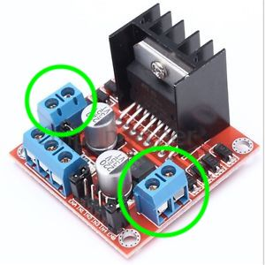

[comment]: # (
Is this step open? Y/N
If so, short description of this step:
Related links:
Related files:
)

## Connecting a motor to the motor board

Intro

You should already be familiar with turning powering and connecting to a Raspberry Pi. If not, follow <!-- link --> this guide to set up your Raspberry Pi.

### 

<!-- Check correctness. Move to the end or next step. -->
A motor controller board will have pins or screw terminals for connecting a motor to it. A DC motor needs two pins or terminals for it to work and a servo motor needs four pins or terminals.

### Discussion

