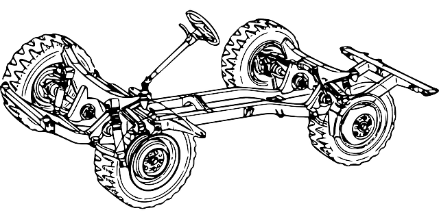

[comment]: # (
Is this step open? Y/N
If so, short description of this step:
Related links:
Related files:
)

## Designing the chassis

Now that you have the motors set up, it's time to design a chassis: the physical frame of your vehicle. Your buggy will need a chassis onto which you can secure the components, such as the wheels, motors, and Raspberry Pi.

### Choosing a material

A chassis for a robot buggy can be built using all sorts of materials: cardboard, plastic, or metal to name a few. The material that works best for you depends on the weight of the components, cost, the skill of the maker, and the tools available. 

When choosing a material, you need to consider aspects such as weight versus durability, cost versus strength, and difficulty to work with versus quality of the chassis. Using certain types of metal might result in a strong and durable chassis, but will be more difficult to modify than cardboard. A cardboard chassis will be light and cheap, but is less sturdy than some other materials.

I recommend making a prototype of the chassis first using a low-cost material, as tweaking the design will then be much easier. Common households items, such as a cardboard box or a plastic ice-cream tub, are perfect for experimenting with the design. The robot buggy that is built throughout the videos in this course uses a chassis made out of a cardboard carton that held grapes. I chose this was because it is a good-sized box that can hold the robot components without needing to be modified. It was also easy to make holes in the carton to attach the components.

### Planning the layout

#### What needs to be attached to the chassis

There is no right way to build your prototype robot chassis, but there are a few things to bear in mind.

At the very minimum, the chassis needs to house the following components:

+ Raspberry Pi
+ Motor controller board
+ Two DC motors
+ Ultrasonic distance sensor
+ Two line sensors
+ AA battery holder (to power the motor controller board)
+ USB battery pack (for powering the Raspberry Pi)

You will also need to mount a pair of wheels to the axles of the motors, and add a ball caster to the front of the chassis that will act as a third wheel.

The line sensors will need to sit on either side of the ball caster and point downwards to the floor. The optimal distance between the line sensors and the floor surface is 1 cm to 3 cm, which should be fine for most buggies.

#### Making sure the components fit

If you are planning on using a pre-made container for the chassis, you can try placing all the components inside to see if there is room. Bear in mind that the components can't all just be shoved in; some parts will need extra space around them so that they can be accessed easily, such as the power supply, which will need to be recharged. Other parts will need to be secured to certain places on the chassis; for instance, the ultrasonic distance sensor must be attached to the front of the chassis so that it can sense objects in front of the buggy.

It can also be useful to design the layout of the buggy on paper, to make sure that all the components have enough room. Begin by making a footprint, which is the base of your buggy. You need to ensure that all the components can fit inside the footprint appropriately. A good method is to represent each component with a piece of paper that you can easily move about, so that you can try out different arrangements.

Make sure each piece of paper is the correct size and shape for the component. You might have to measure your components, but most of them will have technical documentation online that will include their exact dimensions.

#### Advanced design techniques

If you want to know more about creating a physical object and using tools such as 3D modelling and 3D printing, check out our [Design and prototype embedded computer systems course](https://www.futurelearn.com/courses/embedded-systems).

### Your turn

Now it is time for you to design a chassis for your robot buggy and make sure all the components fit:

+ Find a container that you can use for the prototype of the chassis
+ Check that all the components will fit, either by using the actual components, or by mapping them out on paper
+ Check that there is a bit of extra room around the components to account for things such as wiring

### Discussion

What type of container have you used for your chassis? What material is it made out of?

How did you check that all the components will fit?

Share your answers in the comments below. You can also include a link to an image of your chassis by using [Imgur](https://imgur.com/) or another image-hosting platform.
