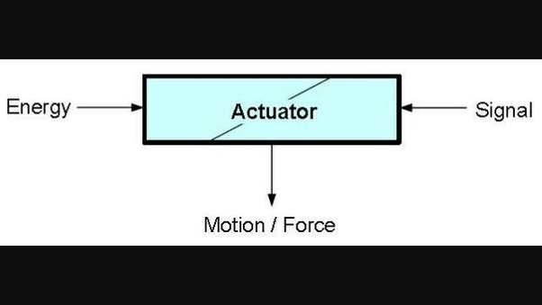
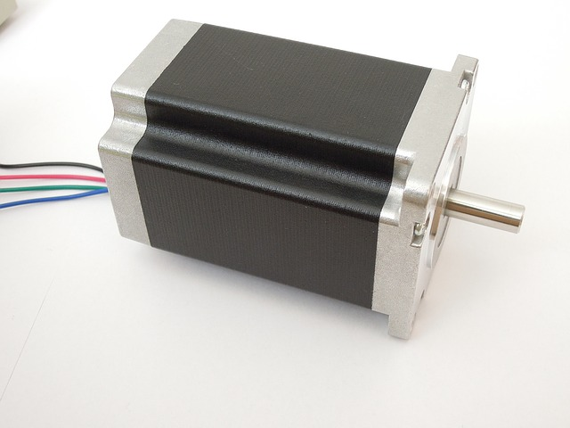
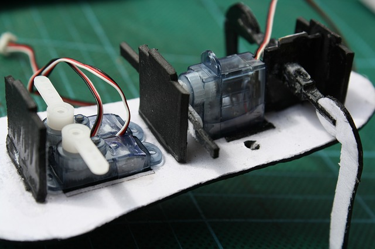
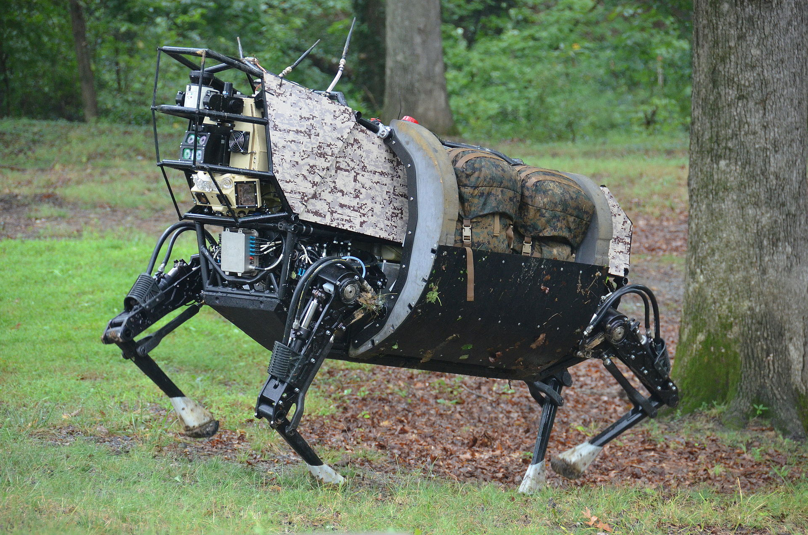

[comment]: # (
Is this step open? Y/N
If so, short description of this step:
Related links:
Related files:
)

[comment]: # (
Should voltage, current etc. be discussed here or in the GPIO step or both?
Should I discuss the Raspberry Pi / microcontroller first?
Is it necessary to go into more detail about pneumatic and hydraulic systems?
)

## Mobile robots

This step covers the different ways that robots can move using actuators, which convert energy into a force much like the muscles in our body do.

### How do robots move?

Nearly all robots will have a movable body of some description. This could be a fully mobile entity that uses motorised wheels or tracks to navigate the environment. It also describes the components that are built from many moveable segments held together by adjustable joints, such as robotic arms. 

<!-- Microcontroller / Raspberry Pi -->

The type of movements a robot can make depends on the **actuators** used. Actuators convert energy into motion, much like the muscle systems of animals. Some are great for moving things with large forces whilst others are better at controlled, precise movements. Choosing what actuators to include in your robot depends on the requirements.

Just like the muscles in our body, actuators need a control signal to know when to act and a source of energy to exert a force. In mechanical systems, there are three main types of energy sources: electrical, pneumatic, and hydraulic. 

### Electric motors

Electric motors use a power supply to convert electrical energy into a mechanical force. The amount of energy that can be transferred to a component is based on the voltage, measured in volts. In the next step, I will go into more detail about the amount of volts that your components and Raspberry Pi can handle without damaging the hardware. For now, all you need to know is that the higher the voltage that the motor receives, the faster it goes!

Every electric motor needs some kind of controller to start and stop the motor and connect to a power source. **Motor controller boards**, like the one you will use when creating the robot buggy, can also have other useful features such as regulating the speed of motors. These boards contain an **H-bridge**, which is a simple circuit that allows you to drive motors forwards and backwards depending on the flow of electricity.

Three of the most common types of electric motors used in robotics are DC, stepper, and servo motors. 

<!-- Check correctness. Move to the end or next step. -->
A motor controller board will have pins or screw terminals for connecting a motor to it. A DC motor needs two pins or terminals for it to work and a servo motor needs four pins or terminals.

#### DC motors

A DC (Direct Current) motor, is relatively simple to control and cheap to manufacture. The speed and direction that the motor rotates depends on the voltage supplied. Providing a motor with a voltage will make it spin in one direction, whilst reversing the voltage makes it spin in the opposite direction. The higher the voltage, the faster the motor will turn and vice versa. 

DC motors can rotate at very high speeds but their major downside is that they are not as good as other types of motor at performing precise movements. Nevertheless, many devices use DC motors for a whole host of applications, for example spinning the fans of a computer and the propellers of a drone. 

#### Stepper motors

A stepper motor moves in small *steps* so it can perform very accurate and discrete movements. Whilst the motor is supplied a voltage, it rotates by a fixed amount per step which are much smaller increments than a DC motor. 

Stepper motors can also produce more torque (the amount of force) at lower speeds than DC motors. This means stepper motors are excellent in devices that require precise positioning and speed control, such as 3D printers and camera lenses.

#### Servo motors

Servo motors are used to control precise *angular* movements and accurate rotations. Some servo motors rotate within a 180 degree range but others are designed to continuously rotate. 

The gears inside a servo motor are designed so they produce a higher torque at higher speeds, meaning that more energy is turned into force rather than speed. This is useful in applications where a large amount of force is required, such as the steering in a remote controlled car and robotic arms. 

### Pneumatic and hydraulic actuators

Pneumatic and hydraulic actuators use pressurised air or liquid respectively to produce a force and generate movement. For example, a hydraulic actuator can be used to power the joint of a robotic leg; the pressurised liquid is released by opening a valve, thereby exerting a force that extends the leg. The valve can then be closed, which allows the pressure to build up again so this process can be repeated.

### Discussion

+ What other examples of devices can you think of that use actuators to produce movement?

+ What type of electric motor do you think would be most suitable for powering the wheels of a robot buggy?

Share your thoughts in the comments section below.