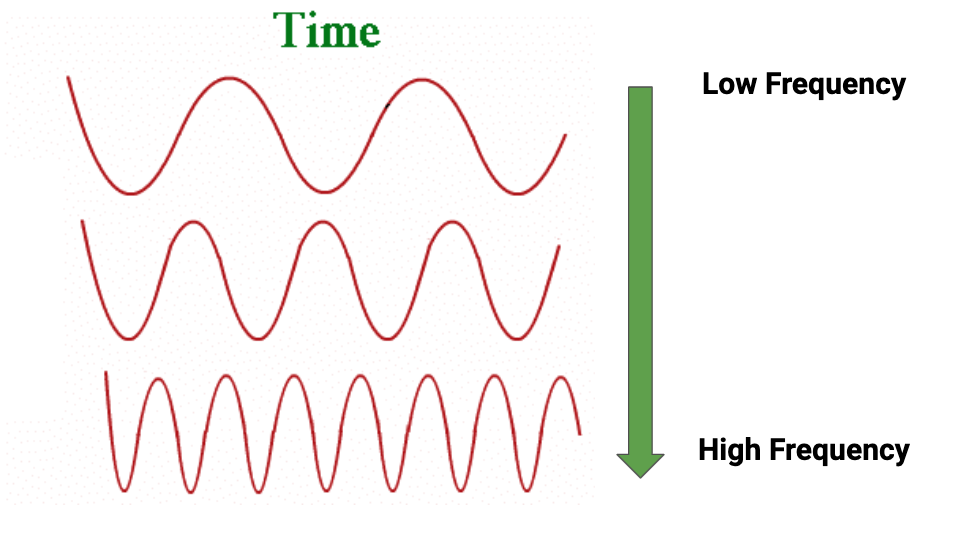

[comment]: # (
Is this step open? Y/N
If so, short description of this step:
Related links:
Related files:
)

## Distance Sensors

In this step I am going to break down the Ultrasonic distance sensor mentioned in the last step. Your robot buggy will use one of these sensors to navigate the physical world around it. Before you wire and code this functionality for your buggy, you should first get to know how these sensors work.

### Ultrasound

Ultrasonic distance sensors (UDS) use ultrasound to measure distances. *Ultrasound* refers to any sound that has a frequency that is above the human range of hearing, this level changes from person to person but on average anything 20 kHz or above is considered ultrasound.

Sound travels through the air in a *wave pattern* one of the ways sounds can be measured is by examining the properties of the pattern. As the sound travels the wave moves up and down, the frequency of a sound is a measure of the time in between the maximum values on that wave.

Ultrasound devices use sound waves at frequencies ranging from 20kHz all the way up to multiple gigahertz. The uses of ultrasound are widespread; doctors use the sound waves to scan inside human bodies, engineers use it to reinforce metals and robots can use it to navigate the world.

### Ultrasonic distance sensor

An ultrasonic distance sensor (UDS) works by sending out a burst of ultrasound. This sound will travel through air, but reflect back (echo) off hard surfaces. The sensor can detect the echo, when it returns.

Using the time measured between the outgoing burst and returning echo, and the speed of sound, you can calculate how far an object is away from the sensor.

Commonly, a UDS require 2 components to do this; an emitter and a receiver. You can see this in the picture above, the two silver cylinders on the front of the sensor are the emitter and receiver.

A particular advantage of these sensors over other distance measurers, specifically those that use light, is that UDS are not effected by the colour of the object that echoes its signal. However, errors can occur if the object can reflect sound away from the receiver.

### How to use a UDS

Now that you have a better idea of what a UDS is and how they work, you can move on to a more practical examination of how to use one with your buggy.

UDSs typically have 4 pins;

+ `VCC` is the pin that powers the device. It needs 5V to work.
+ `Trig` is the pin that sends out the burst. It can be triggered using 3.3V.
+ `Echo` is the pin that outputs when the reflected sound is received. It outputs at 5V.
+ `GND` is the ground pin, used to complete the circuit.

This causes some issues, as the Echo will output 5V and the Pi can only handle 3.3V. This means you will have to use some resistors to create a potential divider.

#### Potential dividers

A potential divider can split a voltage into two smaller voltages. It does this by using resistors. Look at the diagram below. It shows a single resistor connected to 5V. The voltage across the resistor is 5V:

Now look at the diagram below. By using two resistors, the voltage can be split. As both resistors are the same, the voltage is split equally between the two:

By altering the resistors, we can tailor the voltage across any one of them to be anything we like. Here you can see that we have split the voltage to give us almost exactly 3.3V:

To work out the resistors you need, you can use the code below.

~~~python
R1 = 1200 # The smaller of the two resistors (alter this)
Vout = 3.3 # The voltage you are trying to achieve (always 3.3)
Vin = 5 # The input voltage (always 5)

R2 = (Vout * R1) / (Vin - Vout)

print('The resistor you need is approximately',R2)
~~~

### Limitations of a UDS

The biggest limitation of this type of sensor comes when the object that reflects the ultrasound is very close. In this case the microphone might miss the first echo, and instead detect a secondary echo that has rebounded back to the object and then returned. This gives a much higher reading than is accurate.

### Test your potential (dividers)

Using the code and formula above, what size resistors could you use to limit the potential to 1V?

Share your thinking and answers in the comments below.
