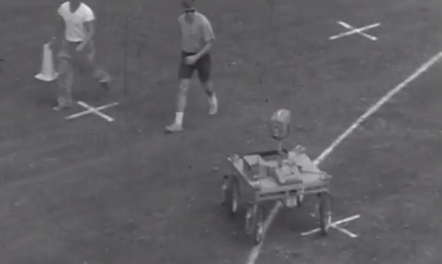

[comment]: # (
Is this step open? Y/N
If so, short description of this step:
Related links:
Related files:
)

## Line sensing robots

This week you will be attaching a line sensor to your buggy and turning it into a line following robot. This type of robot are very popular amongst beginner roboticists, giving you experience with both the software and hardware aspects of robotics. However, line following robots are much more than a learning tool and have a rich history going all the way back to the 1960s.

### What is line sensing, and why are robots doing it?

Line sensing robots (also sometimes called line following robots) move autonomously by following a line - typically drawn on the ground underneath the robot.

In early robotics, line following was seen as a way of allowing robots to move autonomously. Processors at the time were struggling to handle the amount of data required for full autonomous movement with cameras or proximity sensors. Line sensing was pursued as an achievable alternative to true autonomous movement.

### Examples of line sensing robots

As you have heard already, robotics are often used to explore harsh environments that would be difficult for human explorers. In the 1960s one of the biggest exploration projects of all time was in full swing: the space race. Most robots that were built for Moon landings were remote controlled. The massive distance between the earth and moon meant these early moon buggies had to deal with huge delays between instruction and action.

To try to tackle this challenge a team of university roboticists at Stanford created a cart.

**The Stanford Cart**

The Stanford cart started life as a remote controlled mobile robot. A four wheeled cart, its chassis consisted of a rectangular box fitted with cameras and an onboard TV system. Researchers at the university worked on the cart from 1960 to 1980; for a period in 1970 they outfitted the cart with line sensors to test autonomous navigation algorithms.

[Here is a video of the robot following a white line on the ground.](https://youtu.be/8Mxk2L3lu9Q)

[Here is another, the outtakes from the original video start from 6 seconds in.](https://exhibits.stanford.edu/ai/catalog/jk541kq7003)

The robot used a camera pointing towards the ground which tracked a white line drawn by the researchers. The robot would adjust its direction to keep the line in the middle of the picture captured by the camera. It moved at a walking pace and was reasonably successful at this task.

Later the cart would be turned into a fully autonomous vehicle; for a time the cart was the cutting edge of vision controlled robots. Famously the team would let the robot roam the campus unaccompanied, and they created a sign that read "CAUTION ROBOT VEHICLE" to hang when it was out. This sign caused the lead researcher a lot of headaches, as he kept having to get it remade - it kept being taken.

### Modern uses for line following robots

Although line following robots in research were overtaken by more complex autonomy systems, there are still modern robots using this technique. Line following robots excel in situations where the tasks they must complete do not involve complex movement - in other words the movement they must complete does not involve much decision making. A good example is working in a warehouse, where the movement requires following pre-set paths to collect palletes.

**Warehouse Robots**

Warehouses, particularly for large internet shopping companies (think Amazon or Alibaba), require a lot of stock to be moved around the massive buildings. The stock robots move around the warehouses to pick up large cages containing items that have either just arrived or are being prepared for dispatch.

Lines on the floor allow the robots to navigate the busy warehouse space without wasting too much computational power on navigation. Their primary function is to identify and move the stock pile assigned to them. Following the lines allows them to do this without veering off track.

### Competitions

If you search for "line sensing robots" on Google, most of the hits returned relate to robotics competitions. As mentioned earlier in the article, line sensing robots have securely found their place in the robotics world as a good challenge for beginner roboticists.

These competitions pit robots against one another, challenging them to follow a line track as quickly as possible. There are judges who watch the robots and penalise them for straying from the line - either through time penalties or in some cases disqualification.

The size and complexities of the tracks depend on the target audience and their expected experience levels. Some competitions are aimed at children and so the courses are simple small ovals. Some more complex competitions involve line mazes for the robots to map and navigate.

Have a look online, you might be able to find a competition running near you. You could even enter your buggy!

### Other lines to follow

Above I discussed one modern use of line following, in warehouse robots.

**What other types of work could a line following robot perform? Are there any other types of work that only require simple navigation?**

Leave your thoughts in the comments below.
