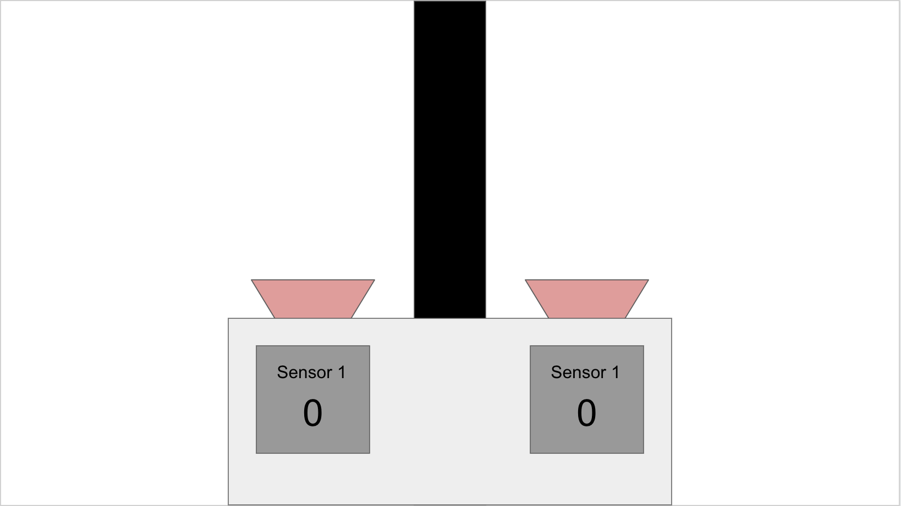

[comment]: # (
Is this step open? Y/N
If so, short description of this step:
Related links:
Related files:
)

## Line sensors and how to use them

In this step you will investigate how a line sensor operates and how it detects a line. I will be using the TCRT5000 IR sensor as my example, but the learning can apply to other line sensors as well. This knowledge will help you design and program a line-following algorithm later in the week.

### Infrared (IR) detection

Line sensors detect the presence of a black or white line by emitting infrared (IR) light and detecting the light levels that return to the sensor. They do this using two components: an emitter and a light sensor (receiver).

You can see an example TCRT5000 line sensor below. Your components may be laid out differently (all on one side, for example), but the components I will discuss will be present on most line sensors.

On the right-hand side of the image above, you can see two components that look like LEDs. The blue one is the IR emitter and the black one is the receiver. These devices also have a component called a potentiometer, which adjusts the threshold for the device. You can do this by using a screwdriver to turn the white dial you can see in the image above.

The device will emit IR light and the sensor will capture the light level that is reflected from the surface underneath. Some line sensors have 2 types of output - analogue and digital. The analogue output is not always present, but will return a constant reading of the light levels the sensor is detecting, but analogue input does not work on the Raspberry Pi. The digital output results from a comparison of the light levels against a threshold level (which is adjusted by turning the potentiometer). If the sensor is not receiving enough light to surpass the threshold value, the digital output will be high (1). If enough light is received and the threshold value surpassed - the pin will be set to low (0).

The setup of these devices may seem a bit backwards at first, but when you consider that the sensor is designed to detect black lines it makes a bit more sense. A black line will not reflect as much light, so the output will be on when a black surface is underneath.

### How to use a line sensor.

Now that you know a bit more about the functionality of a line sensor - you should now learn how to use one!

The line sensor also has an array of pins, some of which you will have to connect to the Raspberry Pi you are using:

+ `VCC` needs to be connected to a voltage in between 3.3 and 5V, in order to power the device.
+ `GND` is the ground pin that is required to complete the circuit
+ `AO` is the analogue output (will not work with a Pi)
+ `DO` is the digital output pin (this will work with the Pi)

The VCC pin here can take a range of voltages so potential dividers are not necessary. It is also worth noting that the `AO` pin does not feature on all line sensors, only some.

### Two sensors are better than one.

You can create a line following robot with only 1 sensor, as this is enough to detect a line underneath the robot. If the robot strays from the line, it is very difficult to work out which way to turn to find the line again.

To solve this problem, you can use more than 1 sensor. If you add a second sensor, and spread them out so they are evenly spaced either side of the caster wheel, the information from both sensors will allow your robot to find the line again.

If the line is in the centre of the robot then both sensors will return a 0 from their digital pins, as they are both over the white background.

However, if the robot moves to the right then the left sensor will eventually cross onto the line - changing its output to a 1. When this happens the robot should correct its course and turn left. Once the sensor returns to a 0 value, we know the line is back in the middle of the robot.

The same applies when the robot turns too far left, the right sensor will move over the line and change its reading. The robot should then turn right to correct.

### Even more sensors

You can use even more than 2 sensors if you want, some designs use 3 or 4.

**How would a 3rd sensor in the center of the robot impact the way it moves?**

**What difference do the extra sensors make?**

Share your thoughts in the comments section.
