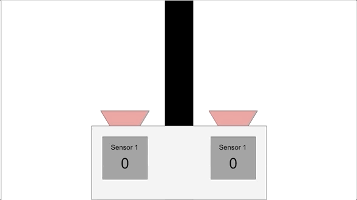

[comment]: # (
Is this step open? Y/N
If so, short description of this step:
Related links:
Related files:
)

## Program a line following algorithm

Now that you have attached the line sensors, you are going to create a basic line following algorithm using the readings from the line sensors. 

### Setting up the motors and line sensors

First, you need to set your program with the components you'll be interacting with before moving on to the line following algorithm. 

**1.** Create a new Python 3 file.

**2.** Set up the program using the code below:

~~~ python
from gpiozero import Robot, LineSensor
from time import sleep, time

robin = Robot(left=(8, 7), right=(9, 10))

left_sensor = LineSensor(19)
right_sensor= LineSensor(26)

robin.forward()
~~~

Don’t forget to adjust the pin numbers if you’ve used different GPIO pins for the motors or line sensors.

The `robin.forward()` command is used to get your robot started.

### Describing the algorithm

The line sensors have 2 states; the line **is** detected or the line **is not** detected. The current state of each sensor will help to define the rules of your algorithm.

To start with, consider what the robot should do when neither of the sensors detect the line. If the line is in the centre of the robot, both line sensors will return a 0 from their digital pins as they are over the white background. In this scenario, the robot should move forwards.

Think about the rest of the line following algorithm: 

+ **What is the initial position of the robot in relation to the line?**
+ **How should the robot react when the left sensor is over the line?**
+ **What about when the right sensor detects the line?**

### Rules of the algorithm

The actions that the robot needs to take depending on the readings from the line sensors are as follows:

+ If there’s a line under the left sensor, turn left
+ If there’s a line under the right sensor, turn right
+ If there’s no line under the left sensor **and** the right sensor, drive forwards

### Using events

To detect the state of each sensor, you are going to use two **events** from `LineSensor`, which is part of the GPIO Zero library. 

So far you have been writing **procedural** programs that generally run instructions from top to bottom, calling functions as they run.

**Event-driven** programs operate somewhat differently. The main difference is that in an event-driven program, the flow of the program and the order in which instructions are run is determined by events like when a button is pressed.

In your program, each of the line sensors will handle two events: `when_line` and `when_no_line`. 

The `when_line` event is triggered whenever the sensor changes state from 0 (white background) to 1 (black line), whilst `when_no_line` is triggered when the sensor changes state from 1 to 0.

### Programming the algorithm

**3.** Within the Python file you set up, instruct your robot to move in a certain direction based on the rules of the algorithm.

~~~ python
left_sensor.when_line = robin.left
right_sensor.when_line = robin.right
left_sensor.when_no_line = robin.forward
right_sensor.when_no_line = robin.forward
~~~

**Note:** Unlike calling a function during a program, you should make sure not to put brackets after the function name when using events.

### Ensuring the program doesn't run forever

Currently, the motors will continue to run even after you close the program. If you ran the program at the moment, you would probably need to turn off the Raspberry Pi to stop your robot from moving.

**4.** To make sure that the robot doesn’t keep running forever, and to close all the component's connections cleanly, add in the following lines of code to the end of your program:

~~~ python
sleep(10)

robin.stop()
robin.close()
left_sensor.close()
right_sensor.close()
~~~

After 10 seconds, the motors will be instructed to stop moving with the `stop()` command. Then the `close()` command will ensure that the motors and line sensors are shut down completely.

You can change the number of seconds to a different value if you want to test the robot for shorter or longer periods of time.

### Testing the algorithm

**5.** Try running the program with your robot on your track.

Here is an example of a robot running on a basic track with this algorithm:

Don’t worry if your robot moves off the line a bit, just observe if it follows the line. If it doesn't, check that the algorithm and the GPIO pin numbers you have specified in the program are correct. You may also need to check that the line sensors are accurately detecting the difference between the white surface and black line, using the instructions for testing the line sensors.

**How well does your robot follow the line?**

**Why do you think the command `robin.forward()` is necessary before the events are defined?**

Share your thoughts in the comments section.
