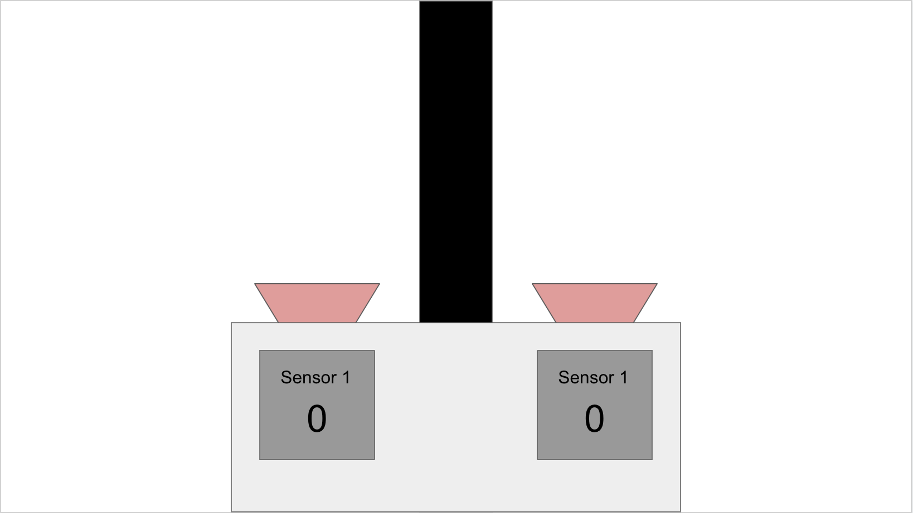

[comment]: # (
Is this step open? Y/N
If so, short description of this step:
Related links:
Related files:
)

## Program a line following algorithm

The line sensors you have attached to your robot buggy should be able to detect the difference between the white surface and black line of your track. You are now going to code, test, and refine an algorithm so that your buggy is able to follow the line of your track. 

### Writing a basic line following algorithm

To begin with, you are going to write a basic line following algorithm to test that your robot is working.

#### Setting up the motors and line sensors

**1.** First, create a new Python 3 file.

**2.** You need to start the program by setting up the motor controller board and line sensors using `gpiozero`. 

~~~ python
from gpiozero import Robot, LineSensor
from time import sleep

robin = Robot(left=(8, 7), right=(9, 10))
left_sensor = LineSensor(19)
right_sensor= LineSensor(26)
~~~

**Note:** In this example, the left line sensor is connected to pin **GPIO 19** on the Raspberry Pi and the right line sensor is on pin **GPIO 26**. Check your build as you may have chosen different GPIO pins for the left and right line sensors, or the pin numbers could be swapped around. 

**Another note:** For the motor controller board in this example, the left motor is on pins **GPIO 7** and **GPIO 8**, and the right motor is on pins **GPIO 9** and **GPIO 10**. Remember, I changed the GPIO pin order for the left motor in my original build in week 1 but yours might be different. Use your previous working code to make sure you have defined the correct GPIO pins for your motors. You may have also renamed the variable `robin` to something else.

#### Programming the buggy behaviour based on the line

Each sensor has 2 states; the line is detected or the line is not detected. For each state, you need to decide what should the buggy do.

If the line is in the centre of the robot then both sensors will return a 0 from their digital pins, as they are both over the white background and the line has not been detected.

However, if the robot moves to the right then the left sensor will eventually cross onto the line - changing its output to a 1. When this happens the robot should correct its course and turn left. Once the sensor returns to a 0 value, we know the line is back in the middle of the robot.

The same applies when the robot turns too far left, the right sensor will move over the line and change its reading. The robot should then turn right to correct.

Based on these assumptions, the algorithm I am going to create should perform the four following tasks based on where the line is:

+ If there’s a line under the left sensor, turn left
+ If there’s a line under the right sensor, turn right
+ If there’s no line under the left sensor, drive forwards
+ If there’s no line under the right sensor, drive forwards

To detect the state of each sensor using the `LineSensor` from `gpiozero`, I am going to use two events: `when_line` and `when_no_line`.

**3.** Define the two states of each line sensor and call a function that moves the robot depending on whether or not a line has been detected:

~~~ python
left_sensor.when_line = robin.left
right_sensor.when_line = robin.right
left_sensor.when_no_line = robin.forward
right_sensor.when_no_line = robin.forward
~~~

By telling the robot to go forward when no line has been detected, but to turn if a line is detected, you can produce basic line following behaviour.

#### Ensuring the program doesn't run forever

Each of the `when_line` and `when_no_line` commands will continue to run, even after you close the program. If you ran the program at the moment, you would probably need to turn off the Raspberry Pi to stop the robot buggy from moving.

To make sure that the robot doesn’t keep running forever, and to close all the components connections cleanly, you can add in these lines to the end of your program:

~~~ python
sleep(20)

robin.stop()
robin.close()
left_sensor.close()
right_sensor.close()
~~~

After 20 seconds, the motors will be instructed to stop moving. Then the `close()` command will ensure that the motors and line sensors are shut down completely. You can change the number of seconds to a different value if you want to test the robot for shorter or longer periods of time.

#### Testing the basic algorithm

**4.** Try running the program once your robot is placed directly over the line of your track.

Don’t worry if you’re robot moves off the line a bit. Just observe if it attempts to stay on the line. If it doesn't stay on the line, check that the algorithm and GPIO pin numbers are correct. You may also need to test that the line sensors are accurately detecting the difference between the white surface and black line.

Here is an example of a robot running on a basic track with this algorithm:

