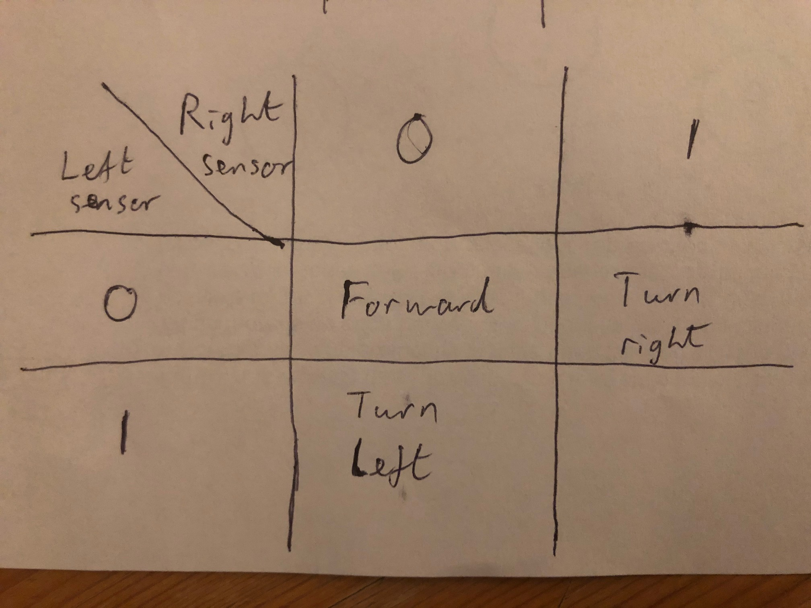

[comment]: # (
Is this step open? Y/N
If so, short description of this step:
Related links:
Related files:
)

## Designing a more complex algorithm

The previous line following algorithm is okay, but the robot can move side to side quite a lot as it tries to keep track of the line. To make the robot's movement more elegant, you can slow down the speed of the robot; this ensures the left and right turns and smaller and therefore more gradual.

However, the `when_line` and `when_no_line` events don't allow you to modify the robot's default speed or other properties. To have more control over the robot, you can adapt your program so that it takes into account the position of the robot, the states of the lines sensors, and the actions required of the motors.

### Setting up the program

**1.** In a new Python 3 file, import the following libraries and set up the motors and line sensors.

~~~ python
from gpiozero import Robot, LineSensor
from time import sleep, time

robin = Robot(left=(8, 7), right=(9, 10))
left_sensor = LineSensor(19)
right_sensor= LineSensor(26)
~~~

So far, the only difference from the start of the previous program is that you are also importing `time` from the `time` library. This will be used to create a timer so the program does not run forever. 

**2.** Initialise the variables for controlling the speed of the motors and the timer.

~~~ python 
speed = 0.75

duration = 20
end_time = time() + duration

running = True
~~~

The multiplier for `speed` usually needs to be above 0.6 otherwise the motors do not have enough momentum to turn on a solid surface. The maximum value for `speed` is 1.

The variable `duration` specifies how many seconds the program will run for. By adding this value to the current `time()` you can calculate the `end_time` for stopping the program.

You will use the `running` variable to specify when the program should stop running.

### Planning a better algorithm

To have more control over the robot's movement, you can read the line sensor values and use these to set the direction and speed of the left and right motors.

Remember that when a line sensor is above a line, it outputs a `1`. When it’s off a line, it outputs a `0`. You can’t pass these values straight to the motors because they have a range from `-1` to `1`; positive values tell the motor to run forwards and negative values run the motor in reverse. 

Taking this behaviour into account, I am going to define whether the motors should be given a positive or negative value based on the line sensor outputs.

### The three rules to rule them all

**Rule 1:**

If both line sensors output `0`, then both motors should receive a positive value to drive forwards.

**Rule 2:**

If the left sensor outputs `1`, the robot has drifted right and needs to turn left. In this case, the left motor should run backwards (a negative signal is needed), while the right motor should run forwards.

**Rule 3:**

If the right sensor outputs `1`, the robot has drifted left and needs to turn right. Therefore, the right motor should run backwards (a negative signal is needed), while the left motor should run forwards.

*Why do you think there is not a rule for both the sensors outputting a `1` simultaneously?*

### Programming the algorithm

To start applying these rules, the code needs to repeatedly read the outputs of the line sensors, in a loop.

**3.** Add a `while` loop to the program after where you initialised the speed and timer variables.

~~~ python 
while running:
    left_detect  = int(left_sensor.value)
    right_detect = int(right_sensor.value)
    
	print (left_detect, right_detect)
~~~

**4.** If you run the program now, you should see the binary output from the sensors, similar to the video below:

**5.** Inside the `while` loop, use conditional statements to specify the direction of each motor depending on the line sensor readings:

~~~ python
while running:
    left_detect  = int(left_sensor.value)
    right_detect = int(right_sensor.value)
    
    # Rule 1
    if left_detect == 0 and right_detect == 0:
        left_mot = 1
        right_mot = 1
    # Rule 2
    elif left_detect == 1:
        left_mot = -1
        right_mot = 1
    # Rule 3
    elif right_detect == 1:
        left_mot = 1
        right_mot = -1

	print (left_mot, right_mot)    
~~~

**6.** Run your code and test that the program outputs the correct motor values when you move the robot over the line.

**7.** Inside the loop, remove the `print` statement and replace it with:

~~~ python
    robin.left_motor.value = left_mot * speed
    robin.right_motor.value = right_mot * speed
~~~

The value for each motor will be modified by the `speed` multiplier to slow down the robot a little. 

Make sure you remove any `print` statements within the loop otherwise this will affect the response time of the program and the robot may "overshoot" the line.

**8.** To stop the `while` loop from running forever, and to close all the component's connections cleanly, add this code inside the loop:

~~~ python
    if time() >= end_time:
        running = False
        robin.stop()
        robin.close()
        left_sensor.close()
        right_sensor.close()
~~~

**9.** Now run your code and test your robot over a track.

Try different values for `speed` (between 0 and 1) and check how your robot runs.
